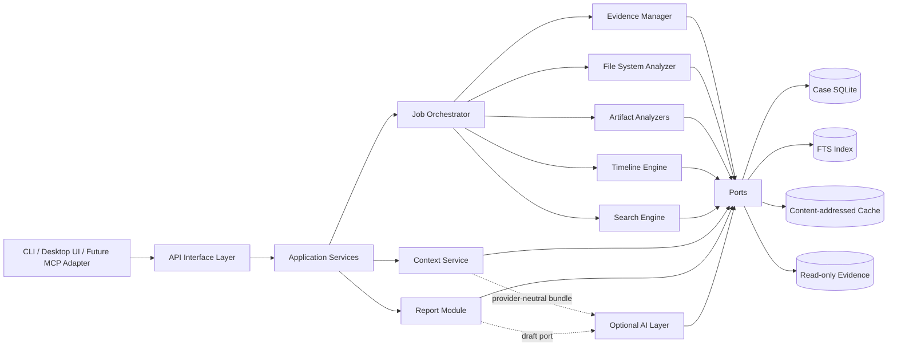
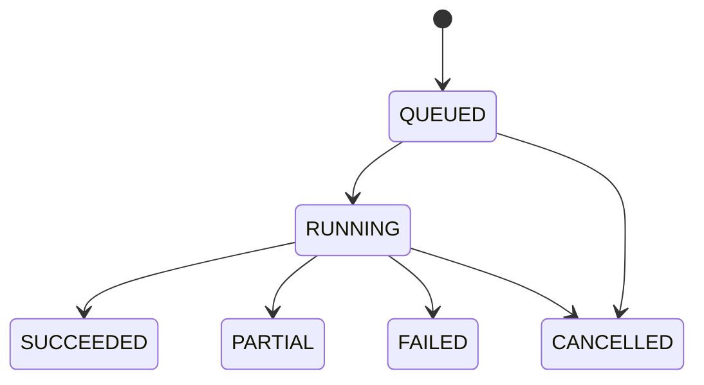
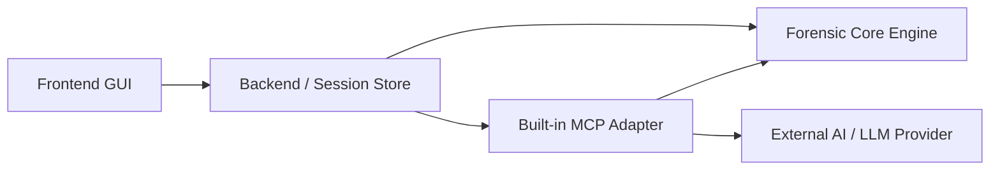
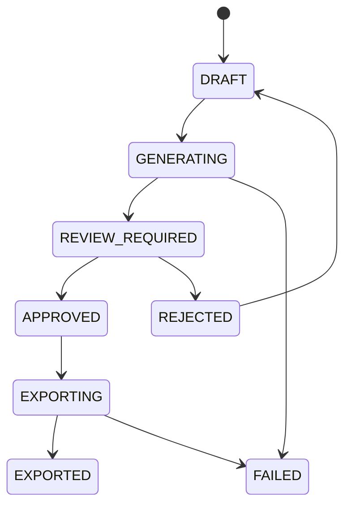

# 전체 아키텍처

## 1. 설계 목표

APEX의 우선순위는 **증거 무결성, 결과 추적성, 대용량 증거 처리 성능, 분석기 확장성**이다.
사용자 친화적인 Ingest Workflow를 제공하되, 각 분석기는 독립 실행과 부분 재실행이 가능해야
한다. 외부 MCP 또는 AI 시스템은 Core의 안정적인 JSON 계약을 통해서만 연결한다.

## 2. 아키텍처 스타일

초기 버전은 **Port/Adapter 구조의 모듈형 모놀리스**다. 프로세스 간 분산 시스템을 먼저
도입하지 않고, 같은 Python 배포 단위에서 모듈 경계와 DTO 계약을 강제한다. CPU 집약 분석은
Process Pool, I/O 집약 처리는 비동기 I/O 또는 제한된 Thread Pool로 분리한다.



의존성은 바깥에서 안쪽으로만 향한다.

```text
Adapters/API -> Application -> Domain/Ports
Analyzers     -> Domain/Ports
Domain        -> 표준 라이브러리 외 외부 시스템 의존 없음
```

## 3. 처리 Plane

| Plane | 책임 | 대표 동작 |
| --- | --- | --- |
| Command/Control | 상태를 변경하거나 장시간 분석을 예약 | Case 생성, Evidence 등록, Hash/Analyzer Job 실행·취소 |
| Query/Result | 이미 저장된 결과를 읽음 | 파일 탐색, Artifact 조회, Timeline, Search, Job 상태 |

Command는 중복 실행을 피하기 위해 `Idempotency-Key`를 지원한다. Query는 대용량 결과에 Cursor
Pagination과 Lazy Loading을 사용한다. 분석 실행 중에도 완료된 Batch는 조회할 수 있다.

## 4. 핵심 데이터 흐름

1. **Case 생성**: Case DB, Cache Namespace, 감사 로그를 초기화한다.
2. **Evidence 등록**: 경로와 형식을 검사하고 읽기 전용 Reader를 연다. 등록 행위 자체는
   증거 내용을 변경하지 않는다.
3. **무결성 계산**: Stream 단위로 SHA-256을 계산하고 호환용 MD5를 함께 기록한다. 시작·종료
   크기와 Reader 상태가 다르면 실패 처리한다.
4. **파일 시스템 Ingest**: Volume/File System/Object 계층과 파일 Metadata를 Batch로 저장한다.
5. **Artifact 분석**: 파일 후보를 Analyzer에 전달하고 정규화된 Artifact와 원본 Provenance를
   저장한다.
6. **파생 처리**: Artifact/File Metadata에서 Timeline Event와 Search Document를 생성한다.
7. **GUI Context 생성**: Backend Session에 현재 화면, 선택 결과, 필터와 시간 범위를 보관한다.
8. **Analysis Context 고정**: AI 요청, Audit 또는 Report에 필요한 기존 결과를 Citation과
   함께 불변 Snapshot으로 저장한다.
9. **조회**: GUI와 MCP Adapter는 같은 API에서 저장된 결과와 Context를 JSON으로 읽는다.
10. **선택적 보강**: AI Layer가 명시적으로 요청된 분석 묶음을 보강할 수 있으나 원본 Fact를
   덮어쓰지 않고 별도 Enrichment로 저장한다.
11. **보고서**: 선택 결과와 AI Draft를 사람이 검토·승인한 뒤 PDF/HTML로 Export한다.

## 5. Evidence Reader 추상화

Evidence 형식별 Adapter는 다음 최소 Port를 구현한다.

| 기능 | 설명 |
| --- | --- |
| `probe` | 형식과 지원 가능성을 부작용 없이 판별 |
| `open_readonly` | 쓰기 기능 없이 읽기 전용 Handle 생성 |
| `read_at` | Offset 기반 Random Access |
| `size` | 논리 크기 반환 |
| `volumes` | Partition/Volume 열거 |
| `capabilities` | 삭제 파일, Sparse, 압축, 암호화 등 지원 여부 명시 |
| `close` | Handle과 임시 Resource 정리 |

지원 계획:

| 형식 | Adapter 방향 | 미지원 상태 처리 |
| --- | --- | --- |
| Directory | OS 파일 시스템 Read-only Adapter | 권한/링크 오류를 개별 Warning으로 기록 |
| RAW/DD | Random Access File + Partition Parser | 알 수 없는 Partition은 Raw Stream으로 노출 |
| E01 | `libewf` 계열 Adapter | 라이브러리 부재 시 `CAPABILITY_UNAVAILABLE` |
| VHD/VHDX | `libvhdi` 계열 또는 검증된 Reader Adapter | 형식별 지원 수준을 Capability로 반환 |

Adapter가 지원하지 않는 기능은 빈 결과로 가장하지 않고 구조화된 오류로 반환한다.

## 6. Artifact Pipeline

Analyzer는 공통 Lifecycle을 따른다.

```text
discover candidates -> prepare -> analyze batches -> emit facts -> checkpoint -> finalize
```

각 Analyzer는 입력 Predicate, 출력 Artifact Type, 버전, 필요한 Capability를 Manifest로 선언한다.
한 Analyzer의 Parser 오류는 전체 Ingest를 중단하지 않는다. 실패 레코드와 Warning을 남기고
Job은 정책에 따라 `PARTIAL` 상태가 될 수 있다.

초기 우선순위:

1. Windows Registry
2. Windows Event Log
3. Windows Prefetch
4. Browser Communications MVP
5. Image/Video Metadata

## 7. 동시성과 작업 상태



- CPU 작업은 Process Pool에서 실행해 GIL 영향을 줄인다.
- File Read는 연속 Offset과 Locality를 우선해 불필요한 Seek를 줄인다.
- Worker는 DB에 직접 쓰지 않고 bounded queue로 Batch를 전달한다.
- Case별 단일 Writer가 Transaction Batch를 커밋해 SQLite Lock 경합을 제한한다.
- `checkpoint_json`에 마지막 Object/Cursor를 저장해 중단된 작업을 재개한다.
- 취소는 협력적 Cancellation이며 Batch 경계에서 확인한다.
- 동일 `input_fingerprint + analyzer_id + analyzer_version + config_hash`는 재사용할 수 있다.

## 8. 저장소와 캐시

| 저장 영역 | 내용 | 정책 |
| --- | --- | --- |
| Workspace Catalog | Case ID, 이름, 상태, Case DB 위치의 재구성 가능한 목록 | Case 검색/열기용, 원본은 각 Case Manifest |
| Evidence 원본 | E01/RAW/VHD/Directory | 읽기 전용, APEX가 수정하지 않음 |
| Case SQLite | Metadata, Artifact, Timeline, Job, Audit | 케이스별 파일, WAL, FK 활성화 |
| FTS Index | 정규화된 Search Document | Case DB의 FTS5로 시작, 교체 가능 |
| Content Cache | 추출 파일, Thumbnail, Parser 중간 결과 | SHA-256 주소, 크기 제한과 LRU 정리 |

Cache는 재생성 가능한 파생 데이터다. Cache 삭제가 Fact나 감사 이력을 삭제해서는 안 된다.

## 9. AI Layer 경계

`ai_layer`는 Core 내부에서도 별도 선택 모듈로 분리하며 기본값은 비활성화다.

```text
Core Fact/Artifact -> AnalysisContext DTO -> AIEnrichmentPort
AIEnrichmentPort   -> EnrichmentResult DTO -> 별도 저장소
```

규칙:

- Provider, 모델명, SDK, Endpoint, Credential을 Domain/API 필수 필드로 두지 않는다.
- Core에는 LLM API 호출과 Prompt가 없다.
- `AIEnrichmentPort` 구현은 별도 Adapter 패키지 또는 별도 프로세스가 담당한다.
- AI 결과는 `source_kind=AI_ENRICHMENT`인 파생 데이터이며 원본 Fact와 병합하지 않는다.
- 입력에 포함된 Evidence/Artifact ID와 출력의 Citation을 기록해 역추적 가능하게 한다.
- 결과는 `Observed Fact`, `Analyst Annotation`, `AI Inference`, `AI Recommendation`으로
  구분하고 AI가 생성한 추론을 Fact로 승격하지 않는다.
- 출력 Locale은 Case의 `locale`을 기본으로 사용하되, 언어 선택이 결과의 증거성을 바꾸지
  않도록 Citation과 원본 값은 그대로 유지한다.
- AI Adapter가 없어도 모든 Core 분석 기능과 API가 정상 동작한다.

## 10. 무결성 및 감사

- Evidence는 읽기 전용 Handle로만 접근한다.
- SHA-256을 무결성 기준 해시로, MD5를 상호 운용 목적의 보조 해시로 저장한다.
- 모든 Artifact에 `evidence_id`, `source_object_id`, `source_path`, `source_offset`,
  `analyzer_run_id`를 기록한다.
- 시간은 원본 문자열, 해석된 UTC 값, 원본 Timezone/Offset, 해석 신뢰도를 함께 보존한다.
- 모든 상태 변경은 Append-only `audit_events`에 남긴다.
- JSON은 `schema_version`을 포함하고 API 계약 변경은 호환성 규칙을 따른다.
- 비밀값, 원본 파일 내용, PII는 일반 로그에 기록하지 않는다.

## 11. 장애 격리

| 장애 | 동작 |
| --- | --- |
| 손상된 파일/Artifact | 레코드 단위 오류 기록 후 다음 대상 계속 |
| Worker 비정상 종료 | Task 실패, 완료 Checkpoint부터 재시도 가능 |
| DB 쓰기 실패 | 현재 Batch Rollback, 감사 로그에 오류 기록 |
| Cache 손상 | Hash 검증 실패 후 폐기하고 재생성 |
| 미지원 Evidence 기능 | Capability 오류 반환, 성공/빈 결과로 위장 금지 |
| AI Layer 장애 | Enrichment만 실패, Core Fact와 Ingest 상태에 영향 없음 |

## 12. 배포 경계

초기에는 로컬 단일 사용자/단일 Host를 기준으로 한다. API Process, Worker Process, Case DB와
Cache가 같은 Host에 있을 수 있다. 원격/다중 사용자 모드가 필요해지면 Repository Port를
PostgreSQL로, Job Port를 외부 Queue로 교체하되 Domain과 공개 DTO는 유지한다.

제품 배포 경계는 다음과 같다.



MCP Adapter는 APEX Desktop Distribution에 기본 포함할 수 있지만 별도 Component다. Core와
같은 Process 또는 저장소에 강제하지 않으며, Core Package Dependency에는 MCP/LLM SDK가
없다.

Workspace에는 Case를 찾기 위한 작은 `catalog.sqlite`를 두고, 각 Case Directory에는
`case.sqlite`와 Manifest를 둔다. Case의 정본 Metadata와 분석 결과는 `case.sqlite`에 있으며,
Catalog는 Case Directory를 다시 Scan해 재구성할 수 있는 Projection이다. 따라서 Catalog
손상이 Evidence Hash, Artifact 또는 Audit 이력 손실로 이어지지 않는다.

## 13. 참고 구조와 적용 범위

| 참고 자료 | 채택한 개념 | 그대로 복제하지 않는 부분 |
| --- | --- | --- |
| [Autopsy Workflow](https://www.sleuthkit.org/autopsy/docs/api-docs/4.3/workflow_page.html) | Case -> Data Source -> Ingest -> Review/Search/Report 흐름 | Java/NetBeans UI와 모듈 Runtime |
| [Autopsy Ingest Modules](https://www.sleuthkit.org/autopsy/docs/api-docs/3.1/mod_ingest_page.html) | Data Source/File Analyzer 분리, Lifecycle, 취소/진행률 | Autopsy 전용 Service API |
| [Sleuth Kit DB Schema](https://github.com/sleuthkit/sleuthkit/wiki/SQLite_Database_v6_Schema) | Object 계층, Ingest Run, Artifact/Attribute 추적 | 기존 Schema의 직접 호환/복제 |
| [Autopsy Repository](https://github.com/sleuthkit/autopsy) | 기능별 Module과 검색/파일 형식 Library 분리 | 특정 Library를 검증 없이 확정 |
| [X-Ways Forensics Tool 참고 프로젝트](https://github.com/tagalston101/x-way-forensics-tool) | 빠른 Timeline/Search 및 확장 분석 방향 | README의 성능 주장을 설계 근거로 간주하지 않음 |
| [X-Ways Forensics MCP](https://github.com/joyooosama/x-ways-forensics-mcp) | Control/Result 분리, 비동기 Job, 안정적 Export Contract | MCP Server, Tool, Session/Prompt 구현 |

참고 프로젝트는 Workflow와 확장 경계를 이해하기 위한 자료다. APEX의 성능과 포렌식 정확도는
별도 Fixture, Benchmark, Library Spike로 검증한다.

## 14. GUI Context와 Analysis Context

| 종류 | 생명주기 | 저장 위치 | 목적 |
| --- | --- | --- | --- |
| Live UI Context | GUI Session 동안 가변 | Backend Memory/Session Store | 현재 화면과 선택/필터 동기화 |
| UI Context Snapshot | 명시적 생성 후 불변 | Case DB | Audit 및 UI 상태 재현 |
| Analysis Context Snapshot | 요청 단위 불변 | Case DB | MCP/AI/Report에 기존 결과 전달 |

Live Context를 매 입력마다 Case DB에 저장하지 않는다. `PUT`은 Session Store의 Revision을
증가시키며, Snapshot은 `case_id`, `locale`, `timezone`, 선택 ID, Filter, 검색 조건, 시간 범위와
Canonical Content Hash를 고정한다.

Analysis Context Builder는 선택 ID를 현재 DB 결과로 Resolve하고 Citation을 만든다. 존재하지
않거나 다른 Case에 속한 ID가 하나라도 있으면 Snapshot 생성 전체를 거부한다. Snapshot은
원본 Evidence를 다시 Parse하지 않으며, GUI에서 이미 생성된 Artifact, Timeline, Search Result,
Annotation, Tag와 기존 AI Enrichment를 조회한다.

```text
GUI Result Selection
  -> Live UI Context
  -> immutable UI/Analysis Context Snapshot
  -> public Engine API
  -> Built-in MCP Adapter
  -> AI Agent
```

## 15. Report Architecture

Report Module은 `template_manager`, `evidence_selector`, `finding_selector`, `timeline_selector`,
`ai_draft_port`, `review_manager`, `approval_manager`, `exporter`로 구성한다.



- `ReportDraftPort`는 Analysis Context와 Citation을 전달하는 Provider-neutral Port다.
- AI Draft는 `REVIEW_REQUIRED`로만 전환할 수 있고 스스로 승인할 수 없다.
- `approved_by`는 사람인 Analyst Identity여야 하며 승인 시 Report Version의 Canonical Hash를
  고정한다.
- Exporter는 `APPROVED`인 동일 Version만 PDF/HTML로 Render한다.
- 승인된 내용을 변경하면 Version을 증가시키고 `DRAFT` 또는 `REVIEW_REQUIRED`로 되돌린다.
- Export 파일은 Hash, Format, Template Version, Locale/Timezone을 기록한다.

## 16. Localization Architecture

Case 기본값은 `locale=ko-KR`, `timezone=Asia/Seoul`이다.

| 영역 | 규칙 |
| --- | --- |
| UI 문자열 | `resource_key`를 GUI Resource Bundle의 한국어 문자열로 변환 |
| 오류 | Engine은 안정적 Error Code와 `message_key` 반환, GUI가 한국어 표시 |
| Artifact | Type별 `display_name_key`, `description_key` 제공 |
| 파일명/경로 | 원본 Unicode/Raw 표현 보존, 표시와 검색 사본 분리 |
| 검색 | 원본을 변경하지 않고 검색 사본에 Unicode 정규화와 Case Folding 적용 |
| 시간 | UTC/원본 Timestamp 보존, GUI/Report에서 Case Timezone으로 표시 |
| AI/Report | Case Locale을 출력 언어로 전달하고 기본 한국어 Template 제공 |

검색 정규화 정책은 Unicode NFKC와 Case Folding을 초기 후보로 두되 원본 문자열에는 적용하지
않는다. 한국어 Keyword Search의 Tokenizer/Trigram 조합은 실제 말뭉치 Benchmark로 확정하며,
한글 완성형·자모·공백·영문 혼합 Query Fixture를 Contract Test에 포함한다.

## 17. Browser Communications와 Media

Browser Communications MVP는 Browser Profile, 방문 URL/History, 검색 History, Download
History/File과 시간 기준 조회다. Email, Discord, Telegram, KakaoTalk 및 기타 Messenger는
공통 Analyzer Plugin 계약을 사용하는 후순위 확장 범위이며 MVP 완료 조건이 아니다.

Media MVP는 Image/Video 분류, EXIF/GPS, Thumbnail, Codec, Duration, 생성/수정 시간과 삭제
상태 표시를 포함한다. Thumbnail은 Cache 파생물이며 원본 Media를 수정하지 않는다. AI는
선택된 Media의 저장된 Metadata와 Citation만 요약하고 사건 관련성 설명/보고서 문구를 제안할
수 있으나 원본을 변경하거나 관련성을 Observed Fact로 확정할 수 없다.

## 18. Backend와 Billing 경계

Token 요금제와 Provider별 사용량은 Backend/Billing 또는 외부 AI Adapter 책임이다. Core는
과금 계산, 요금제, Provider Credential을 알지 않는다. 향후 외부 계약은 `request_id`,
`case_id`, `user_id`, `provider`, `model`, `input_tokens`, `output_tokens`, `tool_call_count`,
`started_at`, `completed_at`을 포함할 수 있지만 이 Event는 AI Adapter가 Backend로 발행한다.
Core는 요청 상관관계용 `request_id`와 `case_id`만 제공하며 사용량 Record를 생성하지 않는다.

## Python-Native 하이브리드 아키텍처

APEX는 Python을 Application 및 Orchestration Layer로 사용하며, 성능에 민감한 처리는 Native Analysis Adapter를 통해 실행한다.

~~~text
Python Application / Orchestration Layer
|-- Case Manager
|-- Evidence Manager
|-- Job Scheduler
|-- Result Aggregator
|-- Timeline Engine
|-- Context Manager
|-- API Interface
|-- GUI / MCP Interface
`-- Report Workflow
          |
          v
Native Analysis Adapter Layer
|-- Evidence Reader
|-- File System Provider
|-- Hash Provider
|-- Search Index Provider
|-- Binary Scanner
`-- Multimedia Processor
~~~

Domain 및 Application Layer는 특정 Native Library API에 직접 의존하지 않는다.

Native 기능은 다음 Port를 통해 추상화한다.

- `EvidenceReaderPort`
- `FileSystemProviderPort`
- `HashProviderPort`
- `SearchIndexPort`
- `BinaryScannerPort`
- `MultimediaProcessorPort`

CPU 집약적 작업은 Process Pool에서 실행하며, I/O 집약적 작업은 Async I/O 또는 제한된 Thread Pool을 사용한다.

Worker 결과는 Bounded Queue를 통해 Case별 Single DB Writer에 전달한다. 여러 Worker가 SQLite에 직접 동시에 기록하지 않는다.

대용량 Evidence는 Chunk Streaming, Offset 기반 Random Access, Lazy Loading 및 Cursor Pagination으로 처리하며 전체 Evidence를 메모리에 적재하지 않는다.

실제 Profiling과 Benchmark에서 병목이 확인된 경우에만 해당 구간을 Rust, C 또는 C++ Extension이나 별도 Native Worker Process로 교체한다.
