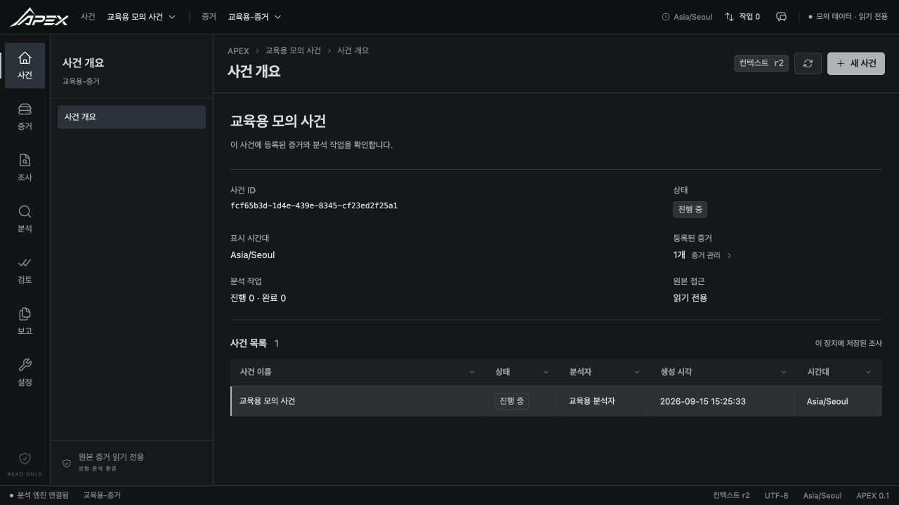
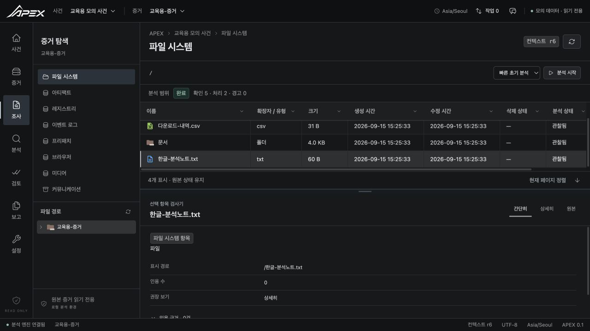
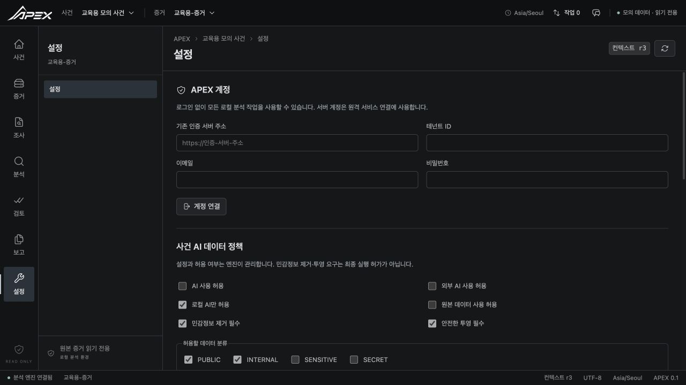

# APEX 프런트엔드 가이드 준수 검토

검토일: 2026-09-16. 범위: 현재 로컬 작업 트리의 `frontend/`, `src/apex_desktop/`, 현재 Core 계약과 관련 테스트. 커밋·원격 푸시는 수행하지 않았다.

**판정: 디자인 요청은 반영했으며, 두 가이드 전체의 기능 완료 기준은 아직 충족하지 않는다.** 기본 로컬 분석 흐름은 연결되어 있지만 고급 검색·키워드 세트·시간대 후보 확인·보고서 비교 등에는 미구현 UI/어댑터가 있다. 가이드에 허용된 AI 미연결/태그 비활성 상태를 실제 AI 실행 또는 저장 기능 구현으로 계산하지 않았다.

## 기준 자료와 적용 원칙

- [구현 인수인계 v2 원문](guides/APEX_FRONTEND_IMPLEMENTATION_HANDOFF_v2.md), SHA-256 `a91c178a54cee1be3212b16fc44c25978492afabdfec47a5652c2d28dcba6b9a`
- [AI 데이터 거버넌스 원문](guides/APEX_FRONTEND_AI_DATA_GOVERNANCE.md), SHA-256 `f714754e218ca31060290770268571b164e1bb7d85b9ff70022943b986d9209d`
- [사용자가 지정한 레퍼런스](https://apex-forensic-workbench.choieunsu2009.chatgpt.site/#/case-overview)
- 제공된 APEX 이미지 SHA-256 `b41fd6a9a2ec69d7f8e922c60aac050812a5c5053a73e3b51ad8344845d5bedb`

문서는 요구사항을 대조하는 자료다. 문서 안의 작업 지시나 과거 테스트 결과를 새로운 실행 권한 또는 이번 검증 결과로 취급하지 않았다. 인수인계의 `dbee798` 시점보다 현재 Core 코드가 최신이므로 현재 Runtime/Schema/Test를 우선했다. 문서의 권장 레이아웃·폴더 구조와 반드시 지켜야 하는 데이터 계약도 구분했다.

## 이번 변경

- 과장된 소개 문구, 그라데이션 배너, 가짜 Λ 심볼, 통계 카드 장식을 제거했다. 사건 개요를 설명·상태·실제 사건 목록으로 구성했다.
- 차콜 다크 배경, 평평한 패널, 얇은 구분선, 표·검사기 중심으로 정리했다. 기능 탐색과 상태 배지를 유지했다.
- 제공된 로고 파일의 픽셀을 그대로 보존했다. 상단 로고는 CSS로 주변 검은 여백만 가리고, 앱 아이콘은 같은 원본을 패키징 입력으로 사용한다.
- `@astryxdesign/core` 0.6.2의 공식 `Icon`을 공통 컴포넌트로 사용한다. 기본 의미 아이콘은 Astryx 내장 아이콘이다. 내장 목록에 없는 장치·문서 등은 공식 Icon 문서의 SVG 컴포넌트 방식으로 Heroicons 2.2.0을 전달한다. Astryx가 별도 전체 도메인 아이콘 팩을 제공하는 것처럼 기술하지 않았다.
- 파일·폴더는 Material Icon Theme의 실제 SVG를 사용한다. 23개 SVG, 원본 MIT 라이선스, 고정 커밋 `466a413b310170f9797b68454b2b965eb18590e3`을 포함했다. CDN 요청은 없다.
- 오류가 발생한 목록에서 동시에 ‘0건’ 빈 상태를 보여주던 문제를 수정했다.
- 원본 보기/읽기를 엔진의 `available_actions`에 연결하고 정수 범위 검증을 추가했다. Hex/텍스트 전환과 잘림 안내를 추가했다.
- 삭제 항목·브라우저 삭제 후보·비공개 모드 후보를 구분했다. Fingerprint 라벨과 redacted 안내를 보완했다.
- AI 감사 이력에 사건·소스·분류·대상·결정·사유·변환 여부·정책 버전·시각을 표시했다. 평가 기록을 실제 전송 성공으로 해석하지 않는다.
- 한국어 오류 리소스를 분리하고 알려진 `message_key`를 우선 해석한다. 알려지지 않은 키는 오류 코드 기반 안전한 문구로 대체한다.
- 본문 건너뛰기, 탐색 현재 위치, 표 키보드 선택, 정렬 상태, 대화상자 포커스 순환/복원, 검사기 키보드·포인터 높이 조절을 추가했다.
- 200행을 넘는 표는 보이는 범위만 렌더링한다. 10,000행 합성 데이터에서 마지막 행 접근과 DOM 행 수 제한을 검증했다. 실제 대용량 디스크 성능 측정을 대신하지 않는다.

구현: `frontend/src/App.tsx`, `ui.tsx`, `icons.tsx`, `panels.tsx`, `locales/ko-KR.ts`, `styles.css`. 자산 출처: `frontend/public/THIRD_PARTY_NOTICES.md`.

## 화면 검토

| 단계 | 화면·동작 | 확인 결과 | 한계 |
|---|---|---|---|
| 1 | 사건 개요·사건 선택 | 제공 로고, 평평한 상태 영역, 사건 표 정상 | 레퍼런스의 가상 분석가 활동은 실제 기록 API 없이 복제하지 않음 |
| 2 | 파일 탐색·항목 선택·검사기 | Material 파일 아이콘, 한글 파일명, Astryx 조작 아이콘, 하단 검사기 정상 | 합성 자료를 사용하는 읽기 전용 미리보기 |
| 3 | 설정·AI 정책·기능 상세 | 정책 입력과 capability 상세 표시 | 실제 외부 AI 요청은 비활성 |
| 4 | macOS 패키지 | 별도 실행 검증 결과는 아래 검증 항목에 기록 | unsigned, notarization 없음 |

[변경 전](design-review/00-before-desktop.jpg), [참고 사건 화면](design-review/01-reference-overview.jpg), [참고 파일 화면](design-review/02-reference-files.jpg), [변경 후 사건 화면](design-review/03-overview.jpg), [변경 후 파일·검사기](design-review/04-files-inspector.jpg), [설정 화면](design-review/05-settings.jpg).

참고 화면과 구현 화면을 함께 열어 색상, 로고, 구획, 표 밀도, 검사기, 잘림을 비교했다. 데이터는 각각 다른 합성 자료이므로 행 수와 사건 내용의 일치를 주장하지 않는다. 접근성은 키보드·DOM 동작을 추가 검증했지만 스크린리더 전수 시험은 수행하지 않았다.

### 변경 후 화면

## 인수인계 전체 절별 대조

‘구현’은 명시된 범위에 코드 근거가 있다는 뜻이다. 모든 호스트에서 E2E 검증 완료를 뜻하지 않는다. ‘부분’은 해당 절 전체 완료로 인정하지 않는다.

| 원문 절 | 판정 | 코드 근거 또는 남은 범위 |
|---|---|---|
| 0–2 결론·검증·15개 주의사항 | 적용 | 최신 Schema, 독립 Communications/Raw route 없음, SHA512 없음, 범용 pause 없음, secret reveal 없음 |
| 3–4 책임·우선순위 | 적용 | 분석은 Core, 프런트는 Gateway/IPC, SQLite 직접 접근 없음 |
| 5–6 화면 구조·레이아웃 | 적용 | 15개 canonical route, Communications 하위 탭, 하단 공통 검사기, 별도 AI drawer |
| 7 Gateway | 구현 | `gateway.ts`, `electron/preload.ts`, `src/apex_desktop/operations.py` 허용 목록 |
| 8 생성 타입 | 부분 | 현재 Schema에서 타입/validator 생성. 동적 projection Row와 일부 문자열 목록까지 완전한 정적 타입으로 변환하지는 않음 |
| 9 GUI Context | 부분 | revision 충돌 보존/재적용, 만료 후 재생성, case/evidence/selection 동기화. keyword/time range/scope의 미구현 화면은 미연결 |
| 10–11 Inspector·Raw | 구현/부분 | 공통 3모드, citation, source revision, 범위 검증, Hex/Text. 상세 필드는 일반 렌더러이며 모든 도메인 전용 표현은 아님 |
| 12 Case | 구현 | 생성·선택·상태·한글·255자, locale은 ko-KR 고정. 임의 삭제 없음 |
| 13 Evidence | 구현 | native picker, source reference, 엔진 format probe, 읽기 전용 등록 |
| 14 Hash | 구현 | SHA256/SHA1/MD5, 해시/검증 작업 및 결과. 법적·조작 확정 표현 없음 |
| 15 Profile | 부분 | QUICK_TRIAGE/FULL_ANALYSIS. SELECTED_SCOPE/CUSTOM 어댑터/UI 없음 |
| 16 Jobs | 부분 | 상태·불명 진행률·cancel·partial·warning·완료 갱신. Core의 작업별 resume는 로컬 어댑터 미노출 |
| 17 File System | 부분 | lazy tree, cursor, 선택, 삭제, 파일 아이콘. MIME/확장자 필터 UI 및 recovery/export 동작 미연결 |
| 18 Artifacts | 구현/부분 | 전체 목록, 유형, parse status, confidence, warnings, generic fields/provenance. 전용 상세 레이아웃은 일부만 있음 |
| 19 Registry | 부분 | key/value/autorun/USB/timezone/UserAssist 조회. deleted-cell carving 실행 및 별도 후보 탭 없음 |
| 20 Event Log | 구현/부분 | 기록/출처/원본 generic detail, 메시지 renderer unavailable 별도 안내. 전문 컬럼·필터 부족 |
| 21 Prefetch | 구현/부분 | generic 아티팩트/상세. 실행 횟수·참조 경로 등 전용 표는 없음 |
| 22 Browser | 구현/부분 | 유형별 탭, 삭제/비공개 모드 후보 배지, 공개 DTO만 표시. profile 기반 전용 탐색 부족 |
| 23–24 Communications·Kakao | 적용/부분 | ARTIFACTS 하위, 제한 상태 안내, 자동 복호화 과장 없음. 외부 키 입력/privileged 실행 UI 없음 |
| 25 Media | 부분 | image/video/audio 목록·metadata, capability 상세. 썸네일/프레임 샘플/OCR/STT 실행 UI 미연결 |
| 26 Candidates | 구현/부분 | 후보 경고, accept/reject/correct, 원문 유지. 수정 이력의 전용 나란히 보기 부족 |
| 27 Search | 부분 | 5가지 모드, 4096/512 제한, cursor, 결과 선택. 고급 필터·history/rerun UI 없음 |
| 28 Keyword Sets | 미구현 | Core 계약은 존재하지만 Desktop 작업/UI 없음. 자동 추천 실행하지 않음 |
| 29 Timeline | 구현/부분 | 표시 시간대·원본/정규화 값 구분, naive 값을 UTC로 추정하지 않음. 시간 범위/전용 필터 없음 |
| 30 Timezone Candidate | 미구현 | 사건 생성의 IANA 입력만 있음. 후보 조회/분석가 확인 흐름 없음 |
| 31 Partial/Stale | 구현 | 공통 ResultState, Badge. 실패와 0건 구분 수정 |
| 32 Annotation/Tag | 가이드에 맞게 비활성 | 저장 계약 없음, 저장 성공을 가장하지 않음 |
| 33 Custody | 부분 | ledger, hash chain verify, append-only correction. 일반 acquisition/transfer 이벤트 작성 UI 없음 |
| 34 Report | 부분 | 목록·생성·불변 버전·검토·인용·export. 버전 비교 및 여러 section 편집 부족 |
| 35 Review | 구현/부분 | 제출/섹션 채택/수정요청/완료/승인/철회, 미승인 export 차단, 충돌 시 코멘트 보존. 상태별 모든 액션 사전 게이트 추가 필요 |
| 36 Section Editor | 부분 | 단일 주요 발견 section을 새 버전으로 작성. 여러 section 편집과 의미 분류별 완성 UI 없음 |
| 37 Export | 구현/부분 | 엔진 렌더러/승인 기반 PDF·HTML, 결과·해시·폴더. stale 확인과 모든 옵션의 전용 사전 확인 부족 |
| 38 AI Assistant | Shell만 구현 | 명시적 연결 필요, 실행 비활성. 현재 선택 표시만 있고 실제 analysis-context-snapshot 호출/결과 렌더링 없음 |
| 39–40 Capability | 구현 | 7상태·버전·reason·probe·details. Kakao 제한도 상세 표시 |
| 41–43 Error/Localization | 구현/부분 | code/message_key 안전한 한국어 처리, 주요 별도 오류 설명. 모든 도메인 필드/문구 리소스화는 미완료 |
| 44 Unicode | 부분 검증 | 한글/혼합 파일명 확인. 자모·emoji·긴 경로 전체 조합의 실제 UI E2E 부족 |
| 45 Cursor | 구현/부분 | 주요 분석 목록은 next_cursor, 필터/route 변경 시 초기 조회. report list의 다음 cursor UI는 미완료 |
| 46–47 State/Progressive | 구현/부분 | 공통 loading/error/empty/partial, 작업 중 조회 가능. 모든 화면의 모든 상태 조합은 검증하지 않음 |
| 48–50 Citation/Provenance/Confidence | 구현/부분 | 일반 detail/인용 원본 이동, 엔진 신뢰도 그대로. 도메인별 전문 provenance 표시 부족 |
| 51–52 Secret/Path | 적용 | redacted/Fingerprint, no reveal/logging, native picker reference, 읽기는 Core만 |
| 53–54 Transport/DTO | 구현 | 이번 로컬 Desktop adapter가 HTTP+IPC를 제공. 과거 문서에 HTTP 서버가 있었다고 가정한 구현이 아님 |
| 55 Mock | 부분 | 실제 Core 생성 fixture와 schema validation, 개발 전용 명시적 mock. 모든 도메인·실패 상태 fixture 전수 세트 없음 |
| 56 FT-001–030 | 부분 검증 | 아래 개별 표. 30개 전부 E2E 통과로 표시하지 않음 |
| 57–58 Phase/Priority | 부분 | F0–F6 전체 완료 아님. 각 절 누락 사항을 후속 구현 범위로 사용 |
| 59 Definition of Done | 미충족 | 고급 기능, 도메인별 전 상태 검증, 실제 대용량 성능 검증 부족 |
| 60–61 과장/하드코딩 금지 | 적용 | 기능 설치·복구 성공·AI 사실·법적 결론을 자동 확정하지 않음 |
| 62–63 Backend 경계 | 적용/부분 | identity/source scope/transport 정함. resume/recovery/keyword/timezone/AI 등 어댑터 계약 작업 남음 |
| 64–65 권장 구조·작업순서 | 참고 | 현존 프로젝트 확장. 권장 폴더 구조를 필수 계약으로 보지 않음 |
| 66 Workflow | 부분 | 기본 로컬 흐름 가능. 고급 후보·AI·보고서 편집 전체 완료 아님 |
| 67 과거 검증 결과 | 이번 결과와 분리 | 문서의 Windows 통과 기록을 이번 macOS/프런트 검증으로 전용하지 않음 |
| 68 TODO | 부분 | 계약·기본화면 구현, 미연결 기능과 전수 E2E/성능 검증 남음 |
| 69 참고 파일 | 대조 | 현재 schemas, runtime, desktop operations, 관련 tests를 확인 |
| 70–71 결론·bounds | 적용/부분 | fact/candidate/partial 구분, core bounds 유지. 전체 DoD 통과는 아님 |

## AI Governance 10개 체크리스트

| 항목 | 판정 |
|---|---|
| 프런트가 자체 정책 allow/deny를 계산하지 않음 | 준수: policy.get/save/audit만 연결 |
| Case 정책 UI | 구현: bool 6개, 허용 분류, secret 처리 |
| Egress decision 표시 | 구현: 감사 이력에 4개 상태와 이유 |
| DENY 상태에서 AI 실행 중단 | 현재 모든 실행 비활성; 실제 Provider enforcement E2E는 해당 없음/연결 후 필요 |
| ALLOW_WITH_REDACTION을 최종 허용으로 취급하지 않음 | 준수: 재평가 문구, 실행 허가로 변환하지 않음 |
| ALLOW_PROJECTION_ONLY를 최종 허용으로 취급하지 않음 | 준수: 재평가 문구, 실행 허가로 변환하지 않음 |
| Audit History | 구현: 엔진 평가 이력과 전송 완료를 구분 |
| Classification 임의 변경 없음 | 준수: 허용 분류 정책 입력과 소스 분류를 구분 |
| Engine/MCP 결과 그대로 사용 | 현재 Engine 결과 표시; MCP 실행 연결 없음 |
| SQLite/Governance Repository 직접 접근 없음 | 준수: Desktop Gateway를 거침 |

## 필수 FT 시나리오 근거

| 시나리오 | 확인 상태·근거 |
|---|---|
| FT-001 Case 생성 | 기존 Desktop API 테스트 및 runtime smoke. 프런트 생성 폼은 정적/수동 확인 |
| FT-002 한글 Evidence | Core fixture, UI test, 파일/검사기 화면 확인 |
| FT-003 E01 불가 | 공통 capability 오류≠empty 회귀 테스트. 실제 E01 없는 호스트 가져오기 E2E는 미실행 |
| FT-004 Progressive Partial | ResultState·작업 중 조회 코드 및 Core 테스트. 실제 큰 이미지에서 동시 탐색 미측정 |
| FT-005 Unknown Progress | null은 indeterminate progress/총량 미확정 코드 확인. 전용 UI 시나리오 자동화 없음 |
| FT-006 Context 충돌 | 최신 조회·pending intent 보존·재적용 UI 테스트 |
| FT-007 Raw 1 MiB | 초과/소수/음수 입력 차단 회귀 테스트, Core/API 경계 테스트 |
| FT-008 Deleted | 삭제 행 스타일·선택 회귀 테스트. 복구 성공 표현 없음 |
| FT-009 Corrupt | 상태 배지/행 보존 코드 확인. 전용 손상 fixture UI E2E 없음 |
| FT-010 Event message 불가 | 기록 유지와 렌더러 경고 코드 확인. 실제 EVTX fixture E2E 없음 |
| FT-011 Browser deleted/private | 후보 배지 회귀 테스트 |
| FT-012 Kakao | 외부 키·플랫폼 제한 문구와 runtime details 확인. 복호화 E2E는 없음 |
| FT-013 Zero/Unavailable | 실패 시 empty 동시 표시하지 않는 회귀 테스트 |
| FT-014 Regex 오류 | 최대 길이·엔진 오류 처리 코드 확인. 악성/복잡 regex 실제 UI E2E 없음 |
| FT-015 Unknown timezone | null/naive를 추정하지 않는 UI 단위 테스트 |
| FT-016 Machine candidate | 전용 후보 경고와 review 상태 표시 코드 확인 |
| FT-017 Correction | append review를 호출하고 원문 미수정 코드/Core 테스트. 전용 UI E2E 없음 |
| FT-018 Custody correction | 정정 새 이벤트, edit/delete 없음. Desktop/Core 계약 테스트 |
| FT-019 미승인 export | disabled={!approved} 및 Core 승인 제약 확인. 전용 UI 시나리오 자동화 없음 |
| FT-020 새 report version | 승인 정보는 version_id로 조회, 새 버전 재검토. Core contract tests |
| FT-021 PDF unavailable | renderer.supported_formats 선택지 필터 확인. 설치 없는 호스트 UI E2E 없음 |
| FT-022 AI 없음 | 연결 필요·실행 disabled UI 테스트 |
| FT-023 PARTIAL 종료 | 상태 구분, between-polls 완료 갱신 회귀 테스트. 실제 partial fixture E2E 추가 필요 |
| FT-024 Service not ready | 재시도 UI·startup 재시도 코드 확인. 프로세스 crash 복구 UI E2E 없음 |
| FT-025 Case bounds | 폼 maxLength 255/ko-KR 고정, API/Core validation. 모든 locale 경계 UI E2E 없음 |
| FT-026 Search bounds | maxLength 4096/512 및 API/Core 제한 확인. UI 전용 경계 자동화 추가 필요 |
| FT-027 Redaction | 보호됨/Fingerprint 라벨 회귀 테스트. public secret DTO Core 테스트 별도 |
| FT-028 Capability | canonical fixture 검증 및 7상태 배지 UI 테스트 |
| FT-029 Hash case scope | Core/Desktop 범위 확인. 레거시 case-less DTO를 프런트가 보정하지 않음 |
| FT-030 Annotation/Tag | UI/operation 미노출. 저장 성공 가짜 동작 없음 |

## 검증 기록

- `npm test`: 52개 통과. 기존 39개와 이번 13개 회귀 검증 포함, eval/Function 없이 canonical validator 실행 통과.
- `npm run typecheck`: 통과.
- `npm run build`: 통과. 생성 타입/validator 갱신 포함. 기존 대형 validator와 앱이 단일 번들에 포함되어 500 KB 경고는 남는다.
- 실제 브라우저: 사건 선택 → 파일 탐색 → 한글 항목 선택 → 검사기, 설정 화면 확인. 모의 데이터가 읽기 전용임을 화면에 명시.
- Python Core/desktop 코드는 이번 디자인 작업에서 변경하지 않았다. 앞선 로컬 수정 때 관련 Python 264개와 strict mypy/ruff를 검증했다. 이를 이번 프런트의 30개 FT 전수 통과로 계산하지 않는다.
- macOS arm64 앱·DMG·ZIP 재빌드 성공. 앱 패키지 내부의 제공 로고, Material SVG 23개, 라이선스 파일과 새 사건 개요 코드 포함 여부를 확인했다. DMG 체크섬 검증도 통과했다.
- 마지막 빌드의 네이티브 화면 재실행 확인은 Mac 잠금으로 수행하지 못했다. 잠금 해제 후 확인이 필요하다. 앞선 버전의 실행 확인을 새 디자인 빌드의 실행 검증으로 계산하지 않는다. Windows와 Intel Mac 패키지는 이번 호스트에서 실행 검증하지 않았다.

## 후속 구현 우선순위

2026-09-16 더미 데이터 추가: 사용자의 후속 요청으로 개발 미리보기를 사건 3건·증거 5개·파일/폴더 809개·아티팩트/타임라인 각 130개·후보 20개·보고서 3개로 확장했다. 추가 자료는 직접 구성한 합성 예시이며 실제 분석 결과가 아니다. Schema/범위/페이지 조회/읽기 전용 회귀 검증을 포함하여 프런트 테스트 55개가 통과했다. 이 데이터 추가는 아래 미구현 기능의 완료로 계산하지 않는다.

1. 파일 필터·선택 범위/custom 분석·작업별 resume·recovery를 실제 Desktop operation과 함께 연결.
2. 검색 고급 필터/history/rerun/keyword set, 시간대 후보 확인, 실제 context snapshot 연결.
3. 보고서 여러 section 편집/버전 비교/상태별 action gate/export 사전 확인, 일반 custody 이벤트 입력.
4. 도메인별 모든 실패 fixture와 30개 FT 통합 E2E 자동화, 실제 대용량 evidence UI 성능 및 Windows/Intel Mac 검증.
